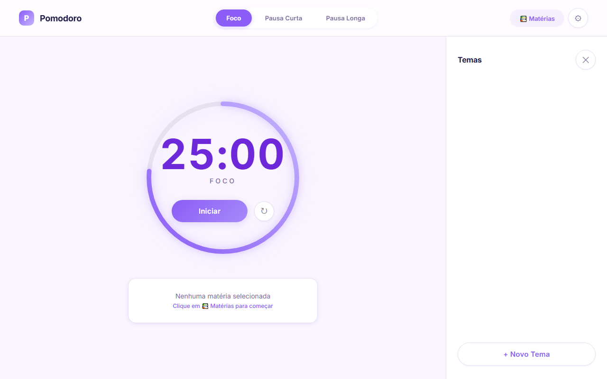

# Pomodoro Timer

Timer Pomodoro elegante com catálogo de temas personalizáveis e controle de matérias de estudo.

## Funcionalidades

- **Timer Pomodoro** — ciclos de Foco, Pausa Curta e Pausa Longa com durações ajustáveis
- **Matérias de estudo** — cadastre matérias com metas de pomodoros; a cada foco concluído, o contador avança automaticamente
- **Catálogo de temas** — 4 temas pré-instalados (Lavanda, Violeta Escuro, Lilás Suave, Amethyst)
- **Editor de temas** — crie seus próprios temas com 5 cores personalizáveis
- **Notificação sonora e visual** — ao final de cada sessão
- **Círculo de progresso animado** — com gradiente suave
- **Tudo persiste no navegador** — temas, matérias e configurações salvos automaticamente

## Como usar

1. Abra o arquivo `index.html` no navegador
2. Escolha um tema no painel lateral (🎨 no celular)
3. Cadastre suas matérias em 📚 Matérias
4. Ajuste as durações nas configurações (⚙)
5. Selecione uma matéria e inicie o timer

### Ícones das matérias

Cada matéria recebe automaticamente um ícone com base no nome.

### Metas

Defina quantos pomodoros você quer completar para cada matéria. Ao atingir a meta, uma notificação de parabéns é exibida.

## Tecnologia

- HTML5 + CSS3 (design responsivo, variáveis CSS, animações)
- JavaScript puro (sem dependências externas)
- `localStorage` para persistência de dados
- Web Audio API para notificação sonora

## Licença

MIT
